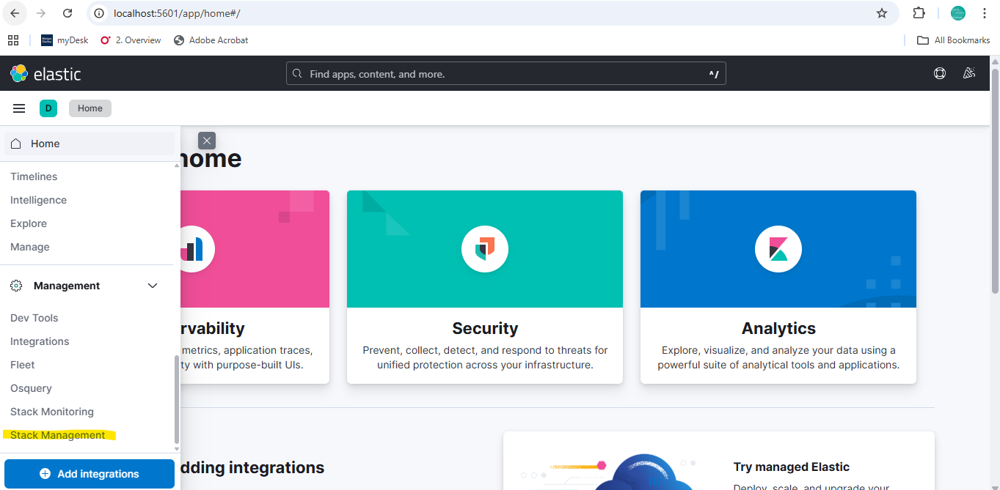
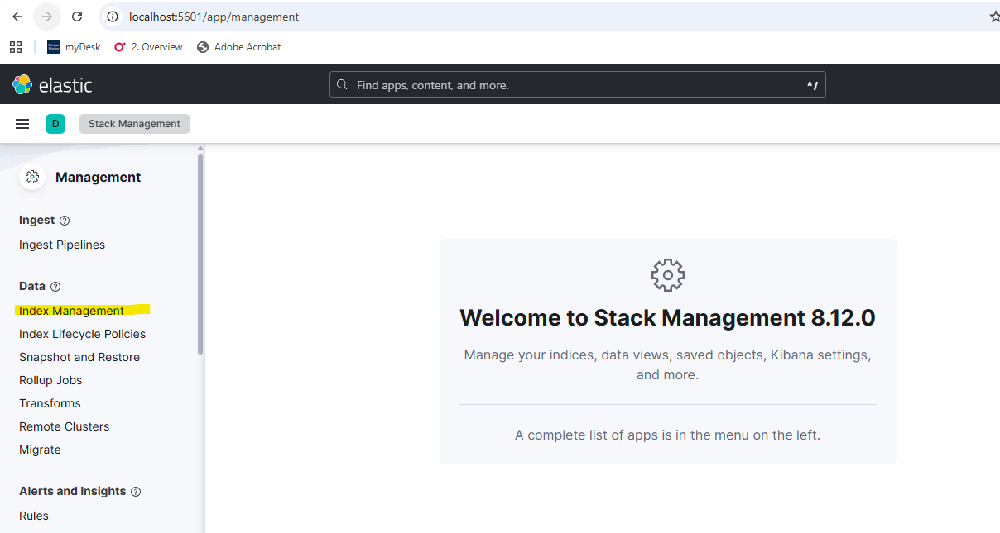
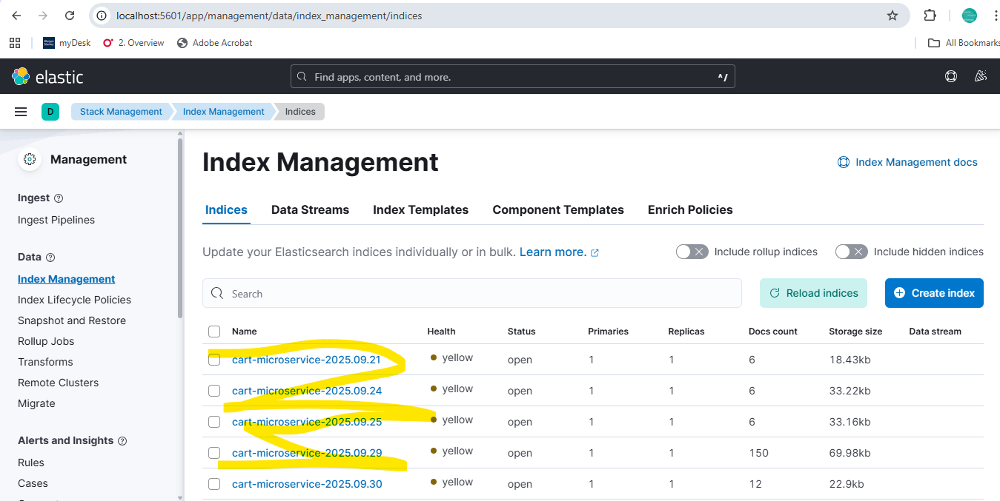
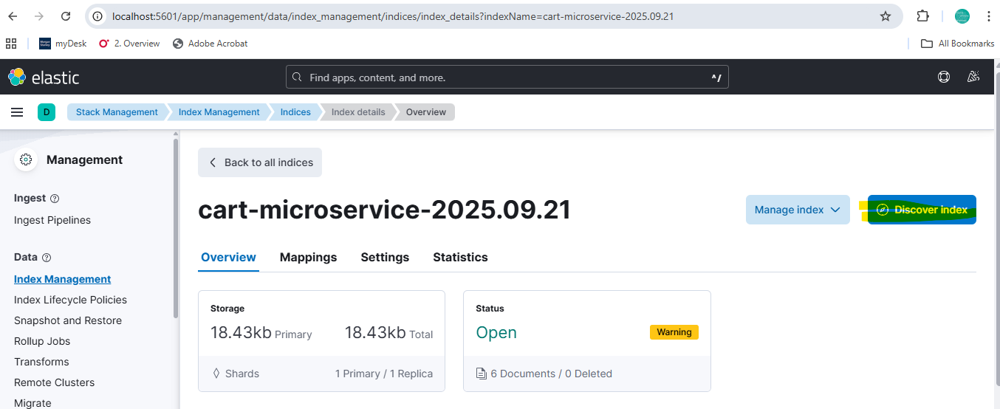
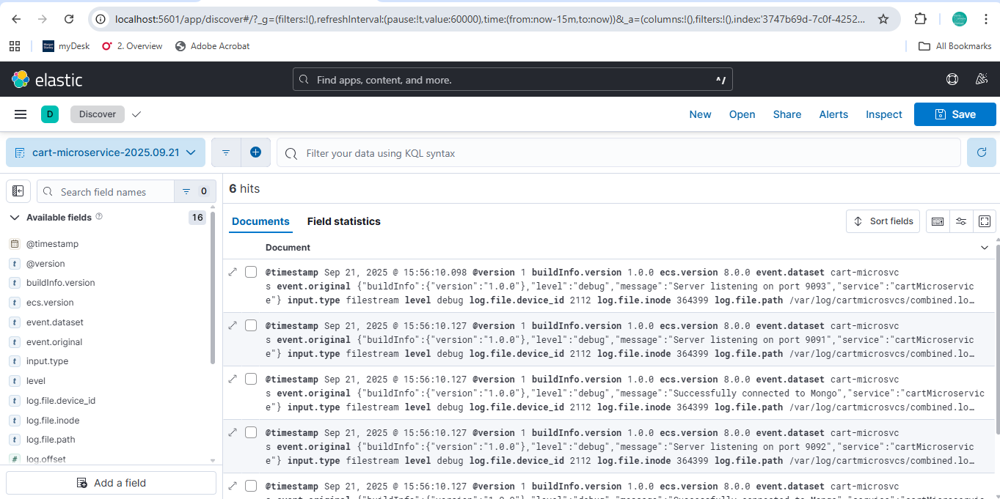

We have used nginx as a reverse proxy through which we access the kibana dashboard.
The ports of kibana, elastic search and logstash have not been exposed. Hence we have avoided
usage of ports: and used expose: instead.
Only nginx is exposed to the internet.


# Logging in Microservices

Challenges of logging in microservices:
1. distributed in nature: Need to locate in which microservice the issue is occuring.
2. log correlation
3. high volume
4. centralisation and management

What is observability ?

Ability to understand the internal state of the system by examining the outputs.
This is possible using logs,metrics, alerts and traces.

Popular logging libraries:

1. winston
2. pino
3. morgan
4. bunyan
5. log4js

Logging Levels:

1. Fatal: Fatal errors can bring the entire app down
2. Error: error in app  that is fatal only for the current operation but the rest of the app continues to function
3. Warning:potential issues but app works
4. info: important details like startup,shutdown
5. debug: state of the app for debugging
6. trace: most detailed logging level. It is used to find the specific place where the error has occured.


Log formats:
1. Unstructured: not recommended. eg: common and combined log format
2. Structured: most recommended. eg: json,xml,key-value pair
3. semi-strucutured

Best Practices

1. Use log levels effectively
2. use structured json
3. use iso-8601 timestamps
4. standardise context like include eventId, microservice name, file detaild, method name, line no etc
5. use correlation id and stack traces
6. be selective for privacy and compliance. do not log sensitive information.

We are using winston + morgan in the microservices project and the gateway project to append the log messages to files. These files are then picked by Filebeat and sent to the ELK stack.

# ELK
The ELK Stack works by using Beats or Logstash to collect data from various sources, Logstash to process and transform it, Elasticsearch to index and store the data, and Kibana to visualize and analyze it through dashboards and charts. Essentially, data is gathered, sent to Elasticsearch for analysis, and then displayed in Kibana for monitoring and troubleshooting purposes.

So each of the microservices and the gateways have the filebeat to collect the log messages. Filebeat will send the log messages to logstash,
which in turn will send it to elastic search. Kibana provides a visual display.

Elastic provides official Docker images for Elasticsearch, Logstash, and Kibana. These images contain the necessary software and dependencies for each component.

# Running in docker

```
docker compose -p elk -f docker-compose.yml build

docker compose -p elk -f docker-compose.yml  up -d --remove-orphans --no-build

```

- Kibana: [http://localhost:5601](http://localhost:5601)
- Elasticsearch: [http://localhost:9200](http://localhost:9200)
- LogStash is listening on 5000 and 5001.


# Logstash

Logstash is the gateway to centralised logging system

Ways of injesting logs:

1. direct transport: directly sending the logs to elastic search

2. file: write the logs to a file. logstash/filebeat then picks up the file, parses them and sends them to elastic search

We are using the 2nd method, where filebeat picks the logs from the file, sends to logstash, which in turn sends to elastic search.

Logstash pipeline is configured using a yml file. It has 3 main sections: input, filter and output

The Logstash configuration is defined in the [`logstash.conf`](./logstash/logstash.conf) file. This configuration listens for Filebeat input on port `5001` and TCP input on port `5000`, and sends the logs to Elasticsearch.

Observe the index field. It picks up the service_name field from the logs. Recall that this has been added to log message for each microservice.
This helps to differentiate between the logs of different microservices and gateways.

```
output {
  elasticsearch {
    hosts => ["elasticsearch:9200"]
    # index => "app-%{+YYYY.MM.dd}"
    index => "%{[service_name]}-%{+YYYY.MM.dd}"
  }
  stdout { codec => rubydebug }
}


```

Hit localhost:5601 to access the Kibana dashboard.



On the RHS, go to Stack Management ---> Index Management.



You can see an index for every microservice



Click on discover index



You can find the logs for that index



Check how github actions works from other README.md of other microservices repo

## Swarm Configs

**You should use Docker Swarm configs whenever you need to distribute non‑sensitive configuration files (like Nginx templates, app configs, YAMLs) across nodes, instead of relying on bind mounts. They are best used when the same config must be available consistently on all nodes, and they are injected into containers at runtime.**

---

## 🔎 What Docker Swarm Configs Are
- **Configs** are objects managed by Swarm that store text files (JSON, YAML, conf, etc.).  
- They are similar to **secrets**, but intended for non‑sensitive data.  
- Swarm automatically distributes configs to the nodes running your service.  
- Inside the container, configs appear as files at the path you specify.

---

## ✅ When to Use Configs
- **Nginx/HAProxy templates**: Instead of bind mounting `/home/.../nginx.conf`, store it as a config.  
- **Application configs**: JSON/YAML files that define service behavior.  
- **Cluster‑wide configs**: Anything that must be identical across nodes.  
- **Avoiding invalid mounts**: When bind mounts fail because files don’t exist on worker nodes.  

Configs are **not for sensitive data** (use secrets for certs, private keys, passwords).

---

## 🛠️ How to Use Configs
1. **Define configs in your stack file**
   ```yaml
   version: "3.8"

   configs:
     nginx_conf:
       file: ./nginx/nginx.prod.conf

   services:
     nginx:
       image: nginx:alpine
       configs:
         - source: nginx_conf
           target: /etc/nginx/templates/default.conf.template
   ```

Key points:
file: points to the config file on the manager node at deploy time.

Swarm stores it in the Raft database and distributes it to the node running the service.

Inside the container, it appears at /etc/nginx/templates/default.conf.template.

It’s read‑only by default.

2. **Deploy the stack**
   ```bash
   docker stack deploy -c docker-compose.yml mystack
   ```

3. **Inspect configs**
   ```bash
   docker config ls
   docker config inspect nginx_conf
   ```

4. **Inside the container**
   - The config file will appear at `/etc/nginx/templates/default.conf.template`.  
   - It is **read‑only** by default.

---

## ⚖️ Benefits vs Bind Mounts

| **Aspect**            | **Bind Mounts**                          | **Configs**                                |
|------------------------|------------------------------------------|--------------------------------------------|
| Node dependency        | File must exist on every node            | Swarm distributes automatically            |
| Portability            | Brittle (path must match)                | Portable across nodes                      |
| Security               | Can expose sensitive files accidentally  | Intended for non‑sensitive configs         |
| Mutability             | Can be changed on host                   | Immutable once deployed (update via redeploy) |
| Best use case          | Local dev, one‑node setups               | Production, multi‑node Swarm clusters      |

---

## ⚠️ Risks & Trade‑offs
- **Immutable**: You can’t edit configs in place; you must create a new config and redeploy.  
- **Not for secrets**: Don’t store certs/keys here — use `docker secret`.  
- **Read‑only**: Apps can’t modify configs at runtime.  

Great question — SSL/TLS certificates are a special case in Docker Swarm, and the choice between **configs** and **secrets** matters a lot.

---

## 🔎 Difference Between Swarm Configs and Secrets
- **Configs**:  
  - Designed for non‑sensitive data (templates, config files).  
  - Stored in Swarm’s Raft database in **plaintext**.  
  - Distributed to nodes as regular files, readable by any container that mounts them.  
- **Secrets**:  
  - Designed for sensitive data (passwords, private keys, certificates).  
  - Stored encrypted in the Raft database.  
  - Only delivered to containers that explicitly request them.  
  - Mounted in memory‑backed filesystems (`/run/secrets/...`), not persisted to disk.

---

## ✅ Best Practice for SSL Certificates
- **Private keys** (e.g. `server.key`) → **must be stored as Swarm secrets**.  
  - They are sensitive and must be encrypted at rest.  
- **Public certificates** (e.g. `server.crt`, intermediate CA chain) → can be stored as **configs** or **secrets**, depending on your security posture.  
  - Many teams still store them as secrets for consistency, even though they’re not confidential.  

---

## ⚠️ Why Not Use Configs for Keys
If you put private keys in configs:
- They’re stored unencrypted in the Raft database.  
- Any container with access to configs can read them.  
- This violates security best practices and may fail compliance checks.

---

## 🚀 Recommended Pattern
For Nginx reverse proxy in Swarm:
```yaml
secrets:
  ssl_cert:
    file: ./certs/server.crt
  ssl_key:
    file: ./certs/server.key

services:
  nginx:
    secrets:
      - source: ssl_cert
        target: /etc/nginx/certs/server.crt
      - source: ssl_key
        target: /etc/nginx/certs/server.key
```

Then in your Nginx config:
```nginx
server {
    listen 443 ssl;
    ssl_certificate     /etc/nginx/certs/server.crt;
    ssl_certificate_key /etc/nginx/certs/server.key;
    ...
}
```

---

👉 In short: **store SSL private keys in Swarm secrets, not configs.** Certificates can go in configs, but most teams keep them in secrets too for consistency and security.  

Would you like me to sketch a **secure Swarm secrets workflow** for managing SSL certs across dev/prod environments, so you don’t have to manually copy them into each node?


Since nginx is acting as reverse proxy, it will receive all client requests.
The stack compose files and nginx config files are copied to the manager node to deploy the stack.

When the worker node tries to run the container, it requires these nginx config files as well.
So a better approach would be to use swarm configs to distribute such data that multiple
 nodes require, instead of copying the nginx config files to every node that requires it.


### How does DNS work ?

## 🔎 How It Works
- **Azure DNS**: You’ve configured DNS records for all nodes (manager + workers). Each node has a public DNS name that resolves to its IP.
- **Swarm routing mesh**: When you publish a port in a Swarm service (`listen 8600;` in your Nginx config), Swarm automatically sets up a routing mesh. That means any node in the cluster (manager or worker) will accept traffic on that published port and forward it internally to the node where the service task is actually running.
- **Result**: Even though Nginx is running on a worker node, if you hit the manager node’s DNS on the published port, Swarm forwards the request to the worker node where Nginx is active.

---

## ✅ Practical Example
Suppose:
- Worker node DNS: `worker1.cloudapp.azure.com`
- Manager node DNS: `manager.cloudapp.azure.com`
- Nginx service published on port `8600`.

You can reach Kibana through either:
```
http://worker1.cloudapp.azure.com:8600/
http://manager.cloudapp.azure.com:8600/
```

Both will work, because Swarm’s routing mesh forwards traffic from the manager node to the worker node where Nginx is running.


👉 So yes, with Swarm’s default routing mesh, you can access the reverse proxy via the manager node’s DNS even though the container is running on a worker.  

Would you like me to show you how to configure `server_name` in Nginx to accept **both manager and worker DNS names** so it works seamlessly regardless of which entry point clients use?

Exactly — that’s the safer and simpler approach in most Swarm deployments.

---

## 🔎 Why
- **Swarm routing mesh**: When you publish a port in a Swarm service, Docker automatically sets up a routing mesh. Any node in the cluster (manager or worker) will accept traffic on that published port and forward it internally to the node where the service task is running.
- **Firewall exposure**: If you open inbound ports on every worker, you’re increasing the attack surface unnecessarily. Since the routing mesh already forwards traffic, you only need to expose the port on one entry point.
- **Best practice in cloud setups**: In Azure, it’s common to expose only the manager node (or a load balancer fronting the cluster) to the internet. Workers stay behind the scenes, reachable only through the overlay network.

---

## ✅ Recommended Pattern
- **Open inbound firewall ports only on the manager node (or load balancer)**.  
- **Keep worker nodes closed to direct inbound traffic** — they’ll still receive traffic internally via Swarm’s routing mesh.  
- **Set `server_name` in Nginx to the external DNS that clients use** (manager DNS or load balancer DNS).  

---

## ⚠️ Exceptions
- If you disable the routing mesh (`mode: host` or direct node port publishing), then you must open the firewall on the specific worker node(s) where the service runs.  
- If you use an Azure Load Balancer, you should open ports only on the load balancer and let it distribute traffic to nodes.

---

👉 In short: **yes, it’s better to expose inbound ports only on the manager node (or load balancer) and keep worker nodes closed.** That way, you minimize exposure while still allowing Kibana access through Nginx.  

Would you like me to sketch a **secure Azure NSG (firewall) rule set** that matches this pattern, so you can apply it directly to your cluster?

So although nginx reverse proxy for elk is running in a worker node, the manager node can also
recieve requests and forward it to the worker node.
This is also the best practice.

For example in dev, nginx listens on port 8600.
So instead opening the firewall port on worker node, open it on manager node. Opening firewall
port is necessary for both worker and manager nodes to open the kibana dashboard in the browser.
Set the server_name to the manager node DNS name.

This ensures all client requests are received only by the manager node and forwarded to the
worker node running the nginx container for elk.
